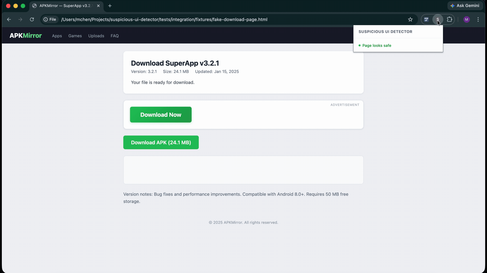

# Deceptive Ad Flagger

A Chrome extension that flags disguised ads and deceptive UI patterns on the pages you browse, using an in-browser small language model.

[](demo/fake-download.gif)

Discovers candidate interactive and ad-container elements in the DOM, builds a token-efficient evidence packet for each one, and classifies them locally with WebLLM. Suspicious elements get a visual badge and outline so you can see what the extension flagged before you click. All inference runs on-device — no backend, no API keys, no data leaves the browser.

## Tech Stack

* **TypeScript** — content script, background service worker, popup
* **React + Tailwind CSS** — popup UI
* **Vite** — bundling and dev server
* **WebLLM** — in-browser small language model inference (WebGPU + WebAssembly)
* **Chrome Extensions API (Manifest V3)** — content scripts, service worker, message passing
* **Vitest + Playwright** — unit and integration testing
## Quick Start

### Prerequisites

* Node.js 20+
* Chromium-based browser with WebGPU enabled
### Build

```
git clone https://github.com/prestonhemmy/ad-flagger.git
cd ad-flagger
npm install
npm run build
```

### Load the extension

1. Open `chrome://extensions`
2. Enable **Developer mode**
3. Click **Load unpacked** and select the `dist/` directory
### Develop

```
npm run dev    # watch-mode build
```

## Architecture

```
+---------------------+    packets   +-------------------------+
|   content script    |  ----------> |   background worker     |   classify  +---------+
|   (per frame)       |              |  - per-tab queue        |  ---------> | WebLLM  |
|  - DOM extraction   |  <---------- |  - hub-and-spoke router |  <--------- | (SLM)   |
|  - visual overlay   |    overlay   |                         |   result    +---------+
+---------------------+              +------------+------------+
                                                  ^
                                                  | settings, status
                                                  v
                                           +-------------+
                                           |    popup    |
                                           +-------------+
```

The extension runs three logical components:

1. **Content script** (`src/content/`) — runs in each frame. Discovers candidate elements (interactive controls + known 
   ad containers), filters by visibility and meaningful content, builds an evidence packet per candidate, and ships them
   to the background worker. Renders overlay highlights on classification results, with overflow-aware clipping and 
   reposition on scroll/resize.
2. **Background service worker** (`src/background/`) — central message router. Maintains per-tab packet queues with 
   iframe priority, drives WebLLM classification, broadcasts pipeline status to the popup, and relays cross-frame 
   highlight messages.
3. **Popup** (`src/popup/`) — React UI for toggling detection, trusting the current site, picking a model, and viewing 
   live status (loading / scanning / done). 

All inter-context messaging flows through the background worker (hub-and-spoke). The content script and popup never message each other directly, which eliminates a class of cross-frame race conditions that show up in star-topology Chrome extensions.

## How It Works

1. **Discovery** — `selectors.ts` queries interactive elements (`a[href]`, `button`, `iframe`, `[role='button']`, etc.) and known ad-container patterns (`adsbygoogle`, `div-gpt-ad`, ezoic, etc.).
2. **Filtering** — drop hidden, tiny, navigation, and content-less elements.
3. **Capping** — at most ~50 candidates per page; ad slots get up to ~30% of the budget before the rest fills with interactive elements.
4. **Evidence packet** — for each candidate, capture a truncated HTML snippet, a curated subset of attributes, computed style for the element and its ancestor chain, position and viewport coverage, and a small window of surrounding text. Sized to fit the SLM context window.
5. **Classification** — packets ship to the background worker, which queues them per-tab (iframes first), prepends each one with a structured prompt (page hostname, same-origin signal, ad-container flag, surrounding text), and feeds them to WebLLM.
6. **Highlighting** — suspicious elements get a red outline and a dismissible badge. Cross-frame flags are relayed to the top-level frame so iframes get badged on the parent page. Overlays clip to the element's visible rect and reposition on scroll/resize.
   A `MutationObserver` watches known ad containers for late-injected SafeFrame iframes and re-runs the pipeline on new candidates.

## Results

Live classification on APK Mirror:

[](demo/apkmirror.gif)

Debug mode showing benign element classification (queued → processing → safe):

[](demo/debug-mode.gif)

> Validation against representative file-hosting sites (APK Mirror, MediaFire) and 8 HTML fixtures was performed during development. Re-validation against the latest prompt and pipeline changes is pending.

## Testing

### Unit (Vitest)

```
npm run test                       # all unit tests
npm run test -- tests/<module>     # single module
```

### Integration (Playwright)

```
npm run test:build-bundle                                # one-time bundle build
npm run test:integration && npm run playwright:report
npm run test:integration -- tests/integration/<file>     # single file
```

### Both

```
npm run test:all
```

## Acknowledgements

Originally co-developed with [Melvin Chen](https://github.com/mchen610) as a senior project at the University of 
Florida, advised by Dr. Ye Xia.

## Author

**Preston Hemmy**

GitHub: [@prestonhemmy](https://github.com/prestonhemmy)

LinkedIn: [Preston Hemmy](https://linkedin.com/in/prestonhemmy)